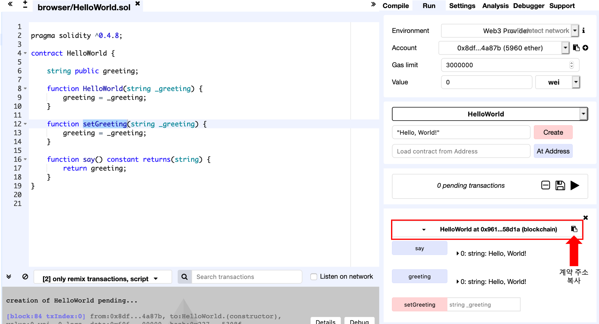
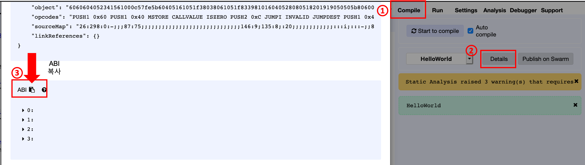

# React 를 이용하여 Dapp 개발하기

## 사전 준비 사항
  * Nodejs >=6 이상 설치
  * 개발을 위한 Ethereum 노드
  * HelloWorld 스마트 컨트랙트 배포

배포된 스마트 컨트랙트 정보를 확인합니다.   
* 계약 주소


* ABI 정보


## React 설치
React 설치 후 프로젝트를 생성합니다. 

```shell
npm install -g create-react-app
create-react-app helloworld_app

cd helloworld_app
```

프로젝트 생성 후 `src` 디렉토리에 있는 모든 `.js`파일을 삭제합니다.
```shell
cd src
rm -rf *.js
```

이더리움 노드와 연동을 위해서 `Web3`를 설치합니다.

```shell
cd ../
npm install --save web3@1.0.0-beta.26
```

`Web3` 초기화 및 접속을 위해서 `src/web3.js` 파일 생성 후 다음의 코드를 입력합니다.

> HttpProvider의 IP 주소는 접속하고자 하는 노드의 주소입니다.   

```javascript
import Web3 from 'web3';

const web3 = new Web3(new Web3.providers.HttpProvider("http://localhost:8545"));
export default web3;
```

다음으로 애플리케이션으로 컨트랙트 호출을 위한 정보를 입력합니다.   
`src/helloworld.js` 파일을 생성하고 앞서 수집한 스마트 컨트랙트 정보(계약 주소, ABI)를 입력합니다.   

> `address` 변수에 계약 주소를 입력하고,   
> `abi` 변수에 ABI 정보를 입력합니다.   

```javascript
import web3 from './web3'

const address = '0x961f2bb6c4a1ecf86600d788ba5b9546e9d58d1a';
const abi = [
  {
    "constant": true,
    "inputs": [],
    "name": "say",
    "outputs": [
      {
        "name": "",
        "type": "string"
      }
    ],
    "payable": false,
    "type": "function",
    "stateMutability": "view"
  },
  {
    "constant": true,
    "inputs": [],
    "name": "greeting",
    "outputs": [
      {
        "name": "",
        "type": "string"
      }
    ],
    "payable": false,
    "type": "function",
    "stateMutability": "view"
  },
  {
    "constant": false,
    "inputs": [
      {
        "name": "_greeting",
        "type": "string"
      }
    ],
    "name": "setGreeting",
    "outputs": [],
    "payable": false,
    "type": "function",
    "stateMutability": "nonpayable"
  },
  {
    "inputs": [
      {
        "name": "_greeting",
        "type": "string"
      }
    ],
    "payable": false,
    "type": "constructor",
    "stateMutability": "nonpayable"
  }
]

export default new web3.eth.Contract(abi, address);
~~~


~~~javascript
import React, { Component } from 'react';
import './App.css';
import web3 from './web3';
import helloworld from './helloworld';

class App extends Component {
  componentWillMount() {
    this.loadBlockchainData()
  }

  async loadBlockchainData() {
    //const web3 = new Web3(Web3.givenProvider || "http://172.16.93.100:8545")
    const accounts = await web3.eth.getAccounts()
    this.setState({ account: accounts[0] })
  }

  constructor(props) {
    super(props)
    this.state = {
        account: '',
        greeting: '',
        inputvalue: ''
    }
  }

  onClick = async () => {
      const returnStr = await helloworld.methods.say().call();
      this.setState({
        greeting: returnStr,
        message: '조회 완료되었습니다.'
      })
  };

  onSubmit = async () => {
    await helloworld.methods.setGreeting().send()
  }

  handleSubmit = async (e) => {
    e.preventDefault();
    await helloworld.methods.setGreeting(this.state.inputvalue).send({
      from: this.state.account
    })
    this.setState({
      message: '처리가 완료되었습니다.'
    })
  }

  handleChange = (e) => {
    this.setState({ inputvalue: e.target.value })
  }

  render() {
    return (
      <div className="content">
        <h1>Hello, World! App</h1>
        <div>
          <p>Your account: {this.state.account}</p>
        </div>

        <div>
          <button onClick={this.onClick}>Say</button><input name="say" value={this.state.greeting} />
        </div>
        <div>
          <form onSubmit={this.handleSubmit}>
            <button type="submit">setGreeting</button>
            <input value={this.state.inputvalue} onChange={this.handleChange} />
          </form>
        </div>
        <div>
          <h3>{this.state.message}</h3>
        </div>
      </div>
    );
  }
}

export default App;
```

```javascript
button {
width: 150px;
   display: inline-block;
  *display: inline;
  zoom: 1;
  padding: 6px 20px;
  margin: 0;
  cursor: pointer;
  border: 1px solid #bbb;
  overflow: visible;
  font: bold 13px arial, helvetica, sans-serif;
  text-decoration: none;
  white-space: nowrap;
  color: #555;

  background-color: #ddd;
  background-image: -webkit-gradient(linear, left top, left bottom, from(rgba(255,255,255,1)), to(rgba(255,255,255,0)));
  background-image: -webkit-linear-gradient(top, rgba(255,255,255,1), rgba(255,255,255,0));
  background-image: -moz-linear-gradient(top, rgba(255,255,255,1), rgba(255,255,255,0));
  background-image: -ms-linear-gradient(top, rgba(255,255,255,1), rgba(255,255,255,0));
  background-image: -o-linear-gradient(top, rgba(255,255,255,1), rgba(255,255,255,0));
  background-image: linear-gradient(top, rgba(255,255,255,1), rgba(255,255,255,0));

  -webkit-transition: background-color .2s ease-out;
  -moz-transition: background-color .2s ease-out;
  -ms-transition: background-color .2s ease-out;
  -o-transition: background-color .2s ease-out;
  transition: background-color .2s ease-out;
  background-clip: padding-box; /* Fix bleeding */
  -moz-border-radius: 3px;
  -webkit-border-radius: 3px;
  border-radius: 3px;
  -moz-box-shadow: 0 1px 0 rgba(0, 0, 0, .3), 0 2px 2px -1px rgba(0, 0, 0, .5), 0 1px 0 rgba(255, 255, 255, .3) inset;
  -webkit-box-shadow: 0 1px 0 rgba(0, 0, 0, .3), 0 2px 2px -1px rgba(0, 0, 0, .5), 0 1px 0 rgba(255, 255, 255, .3) inset;
  box-shadow: 0 1px 0 rgba(0, 0, 0, .3), 0 2px 2px -1px rgba(0, 0, 0, .5), 0 1px 0 rgba(255, 255, 255, .3) inset;
  text-shadow: 0 1px 0 rgba(255,255,255, .9);

  -webkit-touch-callout: none;
  -webkit-user-select: none;
  -khtml-user-select: none;
  -moz-user-select: none;
  -ms-user-select: none;
  user-select: none;
}

button:hover{
  background-color: #eee;
  color: #555;
}

button:active{
  background: #e9e9e9;
  position: relative;
  top: 1px;
  text-shadow: none;
  -moz-box-shadow: 0 1px 1px rgba(0, 0, 0, .3) inset;
  -webkit-box-shadow: 0 1px 1px rgba(0, 0, 0, .3) inset;
  box-shadow: 0 1px 1px rgba(0, 0, 0, .3) inset;
}

button[disabled], button[disabled]:hover, button[disabled]:active{
  border-color: #eaeaea;
  background: #fafafa;
  cursor: default;
  position: static;
  color: #999;
  /* Usually, !important should be avoided but here it's really needed :) */
  -moz-box-shadow: none !important;
  -webkit-box-shadow: none !important;
  box-shadow: none !important;
  text-shadow: none !important;
}

.content {
  margin: 10px 15px;
}

.content div{
  margin: 10px 15px;
}

.content input {
  width: 500px;
  padding: 6px 20px;
  margin-left: 10px;
}
```
